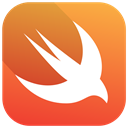
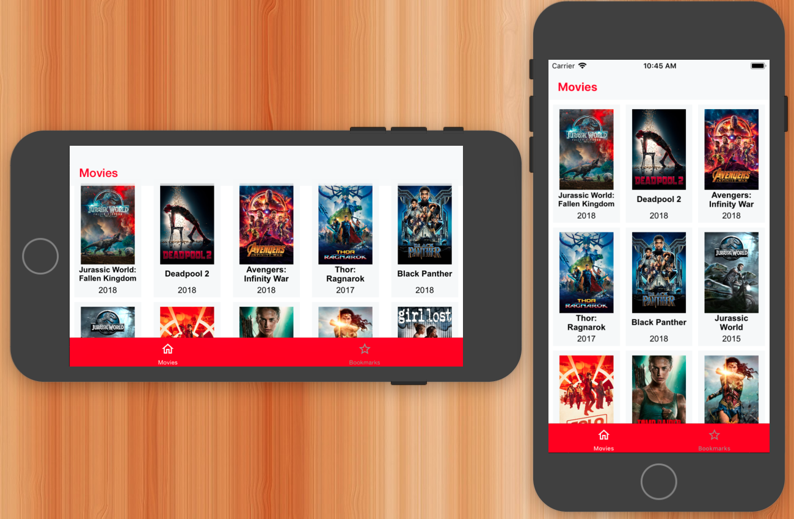
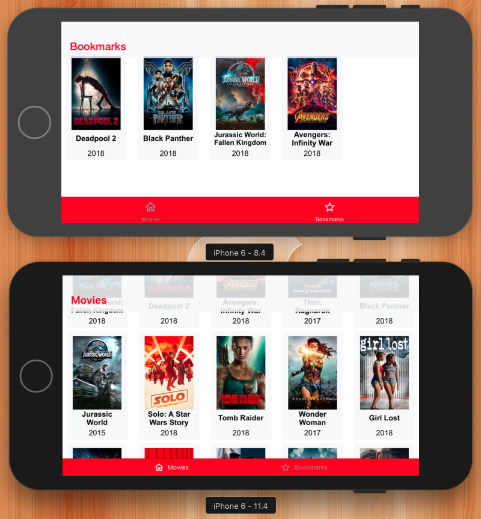
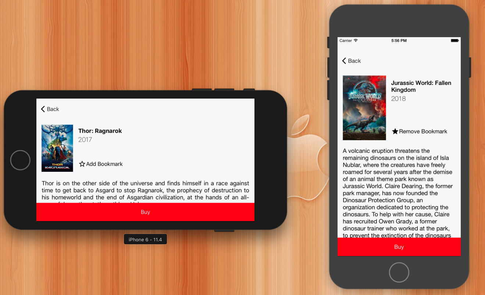
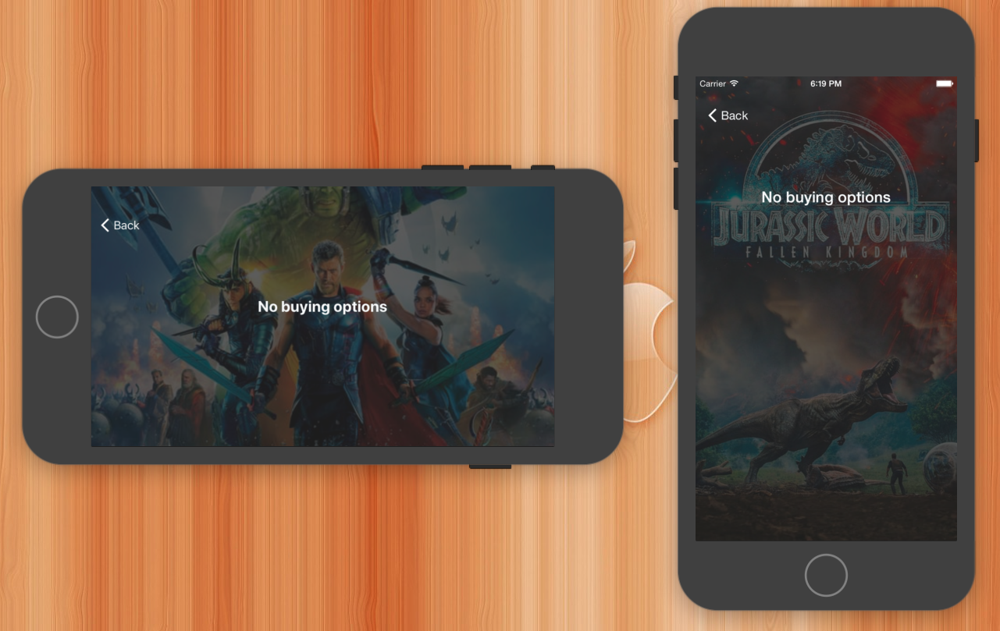
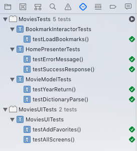

# Movies App - iOS 

Este aplicativo consome uma API com os filmes mais aclamados da atualidade e exibe essas informações aos usuários.
A intenção é demonstrar o uso da Arquitetura Clean e de Swift 4.2 para estruturação de layout adaptável a diversas dimensões de tela e orientação de dispositivo, chamadas a API REST com biblioteca Alamofire, lida com imagens e cache pela lib AlamofireImages, persistência do modelo de dados com Realm, suporte a sistemas to antigos quanto iOS 8.0, testes de unidade, de interface e localização do idioma para PT-BR.

### Linguagem utilizada

- Swift 4.2 

### Características do projeto
1. Compila sem erros e nem warnings
1. Checa se tem conexão com internet
1. Caso haja falha na request, avisa a falha
1. Cache de imagens utilizando o Pod AlamofireImages
1. Scroll infinito na collection view
1. Suporta versão mínima do iOS: 8.0
1. Usa um arquivo .gitignore no seu repositório.
1. Usa Storyboard e Autolayout (suporta todas as telas de iPhones)
1. Suporta orientações Portrait/Landscape.
1. Usa CocoaPods
1. Usa Alamofire para networking
1. Faz parse de JSON -> Objeto
1. Clean-Architecture
1. Localização do app para pt-BR (Base English)
1. Testes unitários com mocks utilizando XCTest Framework
1. Testes funcionais de interface utilizando XCTest
1. Apresenta bom desempenho de memória e processamento (testes com Instruments)
1. Documentação em código e versionamento seguindo boas práticas
1. Interface deslizável (scrolls) deixando app mais fluido em todas as telas

### Instalar/Rodar
1. Baixe ou clone o projeto em um diretório do sistema MacOS
1. Abra o arquivo Movies.xcworkspace com o Xcode
1. Certifique de que o `scheme` selecionado é Movies
1. Aperte o botão de `Run` do Xcode para rodar o app em um dispositivo ou simulador com iOS 8.0+

**Obs:** Não deve ser necessário rodar o comando `pod install` pois os Pods estão armazenados junto com este repositório e estarão pré-configurados

### Mudando o idioma
Se a linguagem utilizada para rodar o app for **português-BR** o app ser apresentado em português (inclusive imagens e títulos dos filmes), do contrário, estará em **inglês**.
- É possivel definir o idioma em que o app rodará editando-se o `Scheme`, ao lado do botão de `Run`
- É possivel definir o idioma em que o app rodará trocando-se o idioma do sistema, nas **Settings do iOS**

### Descrição do aplicativo
- O APP tem 3 telas e consome a API do [**themoviedb**]("https://api.themoviedb.org/)
- A primeira tela em uma tab que lista todos os filmes da base de dados num scroll infinito e possui na segunda aba mostra apenas os filmes favoritos do usuário numa lista persistente do dispositivo.
 
 
- Ao clicar em uma célula de filme, mostra-se o detalhe de algum filme selecionado numa segunda tela. É possível adicionar ou remover um filme como favorito nessa tela. Filmes favoritados persistem num banco de dados local implementado com Realm.
 
- A terceira tela levará às opções de compra do filme.

### Rodando os testes automáticos
- É necessário **rodar os testes em um iOS 9+**
1. Abra o projeto no Xcode utilizando os passos acima
1. Acesse o `Navegador de Testes` do Xcode (CMD + 6)
1. Aperte o botão de `Play` na frente do testes mostrados no navegador de teste

